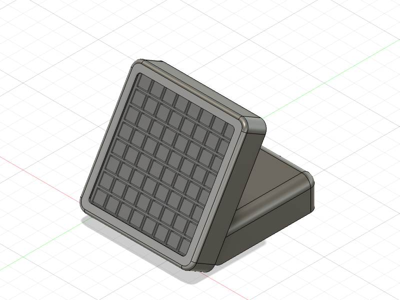
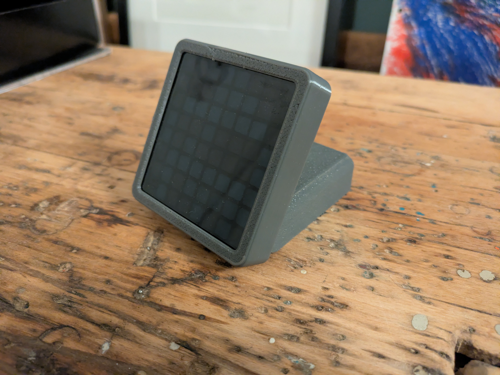
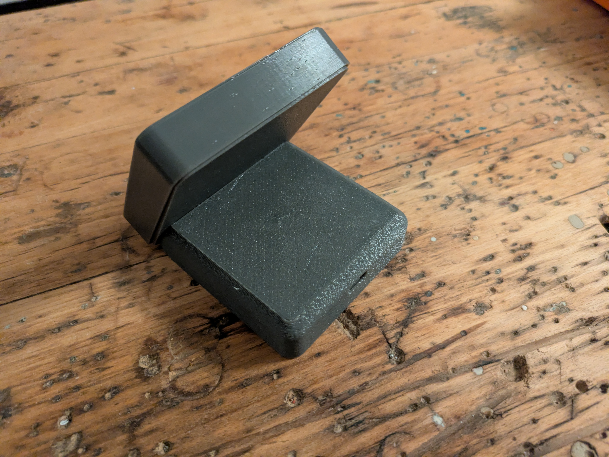
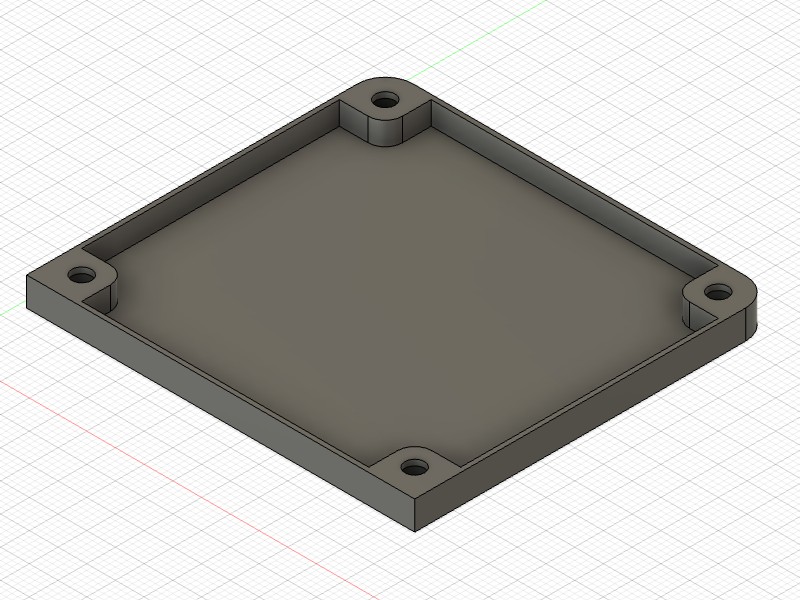
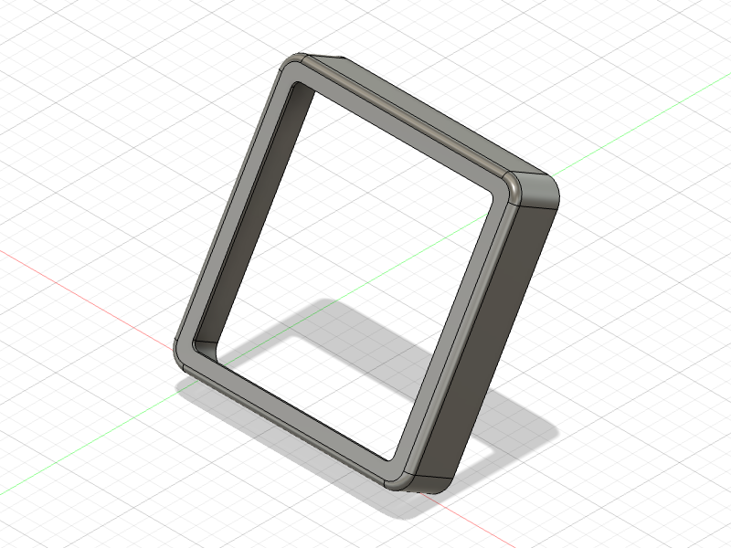
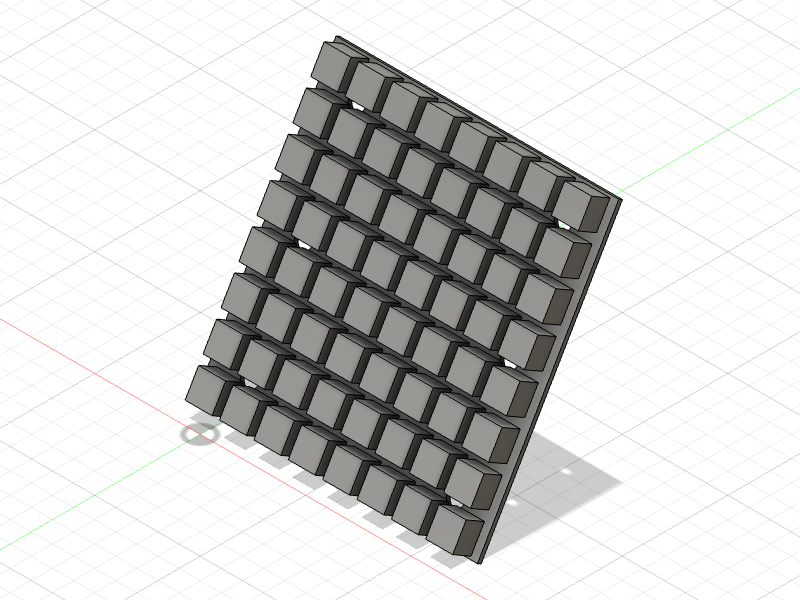
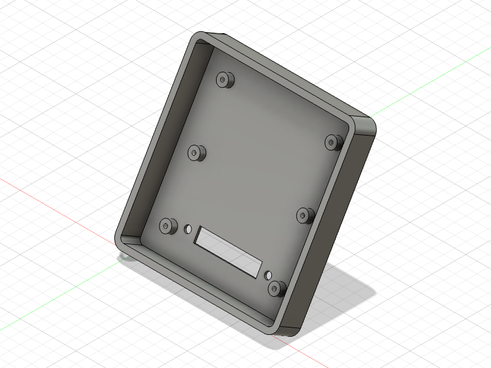
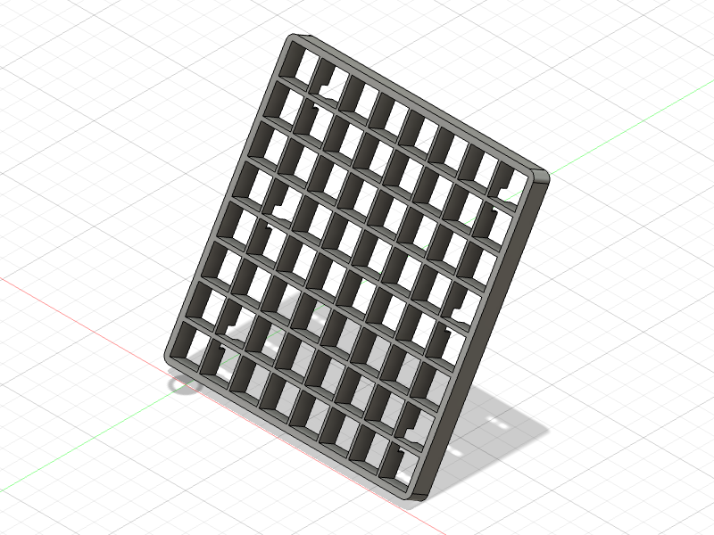

# 8x8 Matrix Display Stand

A universal 8x8 LED matrix display stand with ESP32 for versatile applications.

## Overview

This project provides a desktop stand for an 8x8 WS2812B LED matrix with the following features:

- **Desktop stand** - Stable base for table placement
- **Clean aesthetics** - Acrylic cover and diffuser for a clean look with retro pixel optics
- **Low cost** - Budget-friendly build
- **Versatile applications** - ESP32-based design enables various use cases
- **Easy to build** - Simple to print and assemble

| Example 1 | Example 2 | 
| --------- | --------- | 
|  |  | 

## Features

- Compatible with standard WS2812B 8x8 LED matrices
- ESP32-based for WiFi connectivity and smart home integration
- Modular design with separate diffuser and grid for optimal light distribution
- All parts designed to print without supports
- Optional semi-transparent acrylic front panel for enhanced appearance

## 3D Printed Parts 

All printable parts and preview images are located in the `print/stl/` and `print/png/` folders.

| Filename | Thumbnail | Notes |
| -------- | --------  | ----- | 
| `base_box_cover.stl`|  | Cover for the base |
| `display_cover.stl` |  | Display cover |
| `display_diffusor.stl` |  | Display diffuser - print in translucent PLA |
| `display_frame_base.stl` |  | Frame base |
| `display_grid.stl` |  | Grid for diffuser - print in black |

### Print Settings

- **Supports:** None required
- **Material:** PETG or PLA recommended
- **Diffuser:** Print in transparent or semi-transparent material; PLA works best for smooth surfaces and even light distribution
- **Grid:** Recommended to print in black, especially when using blackened acrylic plate

## Bill of Materials

| Unit Price | Quantity | Part Name                   | Example Link | Notes |
| ---------- | -------- | -------------------------- | ------------ | ----- |
| $5         | 1        | ESP32 Dev Module           | [AliExpress](https://de.aliexpress.com/item/1005006474308440.html) | USB-C version recommended |
| $2         | 1        | Semi-transparent Acrylic Board | [AliExpress](https://de.aliexpress.com/item/32857098929.html) | Optional. Best results with semi-transparent black acrylic (2mm thick). Thinner sheets may require adhesive. |
| $2         | 1        | WS2812B 8x8 LED Matrix Module | [AliExpress](https://de.aliexpress.com/item/1005007398953448.html) | Standard 8x8 matrix |

## Hardware Requirements

- 6× M3×10mm cylinder head screws 
- 4× M3×6mm cylinder head screws 
- 6× M2×4mm cylinder head screws 

## Assembly Instructions

1. **Mount ESP32:** Secure the ESP32 to the base using 4× M3×6mm screws
2. **Attach frame base:** Mount the display frame base to the base using 2× M3×10mm screws
3. **Install LED matrix:** 
   - Solder wires to the LED matrix
   - Route the cable through the opening between the display frame base and the base
   - Connect to the ESP32
   - Secure the display to the display frame base using 6× M2×4mm screws
4. **Add diffuser:** Place the diffuser and insert the diffuser grid
5. **Install acrylic panel:** Cut the acrylic plate to size and glue it into the display cover
6. **Final assembly:** Place the display cover on top and optionally secure with adhesive
7. **Close base:** Attach the base cover and secure with 4× M3×10mm screws

See the assembly animation below for visual guidance:

## Usage Example: Solar and EVCC Control Display

Example implementation for Home Assistant via ESPHome using animated GIFs to showcase the display's capabilities.

This example consolidates solar system and electric vehicle charging (EVCC) status into a single icon. It demonstrates how to implement such use cases in ESPHome and can be easily adapted for other applications. 

### Features

* Home battery charge level
* Solar charging battery active (excess solar power stored in battery)
* Solar feeding to grid active (hence consider solar excess charging via EVCC)
* Battery depleted and home is now powered by grid
* Vehicle connected to EVCC charger and charging status

### Prerequisites

- home assistant
- ESP home

### Installation

1. Register the ESP32 with ESPHome (e.g., via ESPHome Web).
2. Rename the device to matrix-display (so that `color-matrix-display.yaml` is the .yaml of your ESP home configuration for the device)
3. Copy the contents of [./ha_scripts](././ha_scripts) to the folder `[homeassistant]/config/esphome`, replacing `color-matrix-display.yaml` and include the images subfolder.
4. Customize the entity names in the yaml according to your configuration
5. Open `color-matrix-display.yaml` in ESPHome and upload the configuration to the device.
6. Once installed, the device will appear in Home Assistant. Set up the device giving it a name 
7. The device will show up in Home Assistant under the ESPHome integration. There you can change the default brigtness or see debug information

## Development

Contributions are welcome! Please see `CONTRIBUTING.md` for details and follow the `CODE_OF_CONDUCT.md` when contributing.

All .stl, .png, and assembly pictures are automatically exported via my Fusion add-in, see [here](https://github.com/smengerl/fusion-exporter)

## License

This project is licensed under the Beerware License — see `LICENSE.txt` for details.

## Author

- Simon Gerlach - [GitHub Profile](https://github.com/Smenger)

---

**Need Help?** If something in this README is missing or unclear, please [open an issue](../../issues) so we can improve the documentation.
